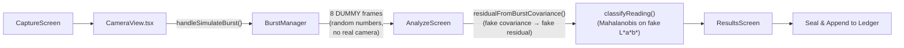
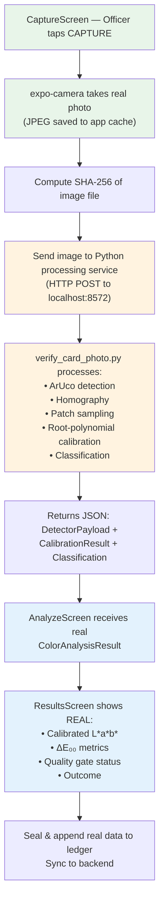
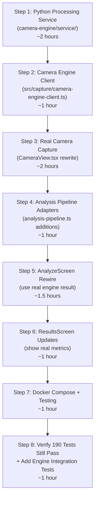

# Camera-Engine → Parinaam App Integration Plan

> **Status: implemented (2026-09-24).** This file is retained as the original
> implementation plan for audit context. It is not the current API contract or
> operational guide; the implemented, authoritative instructions are in
> [`docs/camera-engine-integration.md`](docs/camera-engine-integration.md) and
> [`camera-engine/service/README.md`](camera-engine/service/README.md). The
> production path uses `POST /v1/analyze`, the `parinaam-camera-engine-v1`
> contract, one real `expo-camera` photo, and a Docker-only local service.
> Any references below to simulated helpers, `/analyze`, old field names, or a
> native plugin as the production path describe the pre-implementation state
> and must not be used to wire new code.

> **Context**: We've been shortlisted from 900 teams → 25 finalists at SIH. Demo phase is done.
> Now the app needs to feel **real** — the camera capture is currently 100% placeholder/simulated.
> The `camera-engine/` contains the actual computer vision + color science pipeline.
> This plan integrates it so: **officer taps capture → real camera photo → camera-engine processes it → real result**.

---

## PHASE 1 — CURRENT ARCHITECTURE (What We Have)

### 1.1 Mobile App — Current Capture Flow (ALL SIMULATED)



**What's placeholder**:
- [`CameraView.tsx`](file:///home/zape/Projects/parinaam-app/src/capture/CameraView.tsx) — No real camera. Generates 8 dummy `CaptureFrame` objects with `Math.random()` quality values and hardcoded fake `colorObservation: [18.5, 34.2, -12.0]` L*a*b* triplets.
- [`burst-manager.ts`](file:///home/zape/Projects/parinaam-app/src/capture/burst-manager.ts) — Computes covariance from those fake observations. Real math, fake data.
- [`analysis-pipeline.ts`](file:///home/zape/Projects/parinaam-app/src/services/analysis-pipeline.ts) — `residualFromBurstCovariance()` converts fake burst spread into a fake calibration residual. `synthesizeKinetics()` generates fake ΔE(t) sigmoid curves.
- [`AnalyzeScreen.tsx`](file:///home/zape/Projects/parinaam-app/src/screens/AnalyzeScreen.tsx) — Consumes the fake burst, runs fake pipeline stages with `setTimeout()` delays.

**What's real (and stays)**:
- Session store wizard (Setup → Capture → Analyze → Results)
- Hash-chain sealing (`crypto/hash-chain.ts`, `crypto/sealer.ts`)
- Ledger append (append-only SQLite with anti-mutation triggers)
- Server sync (PostgreSQL backend on port 8571)
- 190 passing tests

### 1.2 Camera-Engine — What It Actually Does

The camera-engine has **two processing paths**:

#### Path A: Python Script (offline verification — `verify_card_photo.py`)
- **Input**: A JPEG/PNG file path + `card_v1_geometry.yaml`
- **Process**: OpenCV ArUco detection → Homography → Patch sampling → Root-polynomial calibration → CIEDE2000 classification
- **Output**: Console printout of calibrated Lab values, ΔE₀₀ per patch, classification result
- **This is the one that works with "passing an image to it"**

#### Path B: Native Kotlin Plugin + TypeScript Engine (mobile integration — the REAL pipeline)
- **Native** ([`CardDetectorPlugin.kt`](file:///home/zape/Projects/parinaam-app/camera-engine/mobile/android/app/src/main/java/com/parinaamcolorengine/CardDetectorPlugin.kt)): Runs inside VisionCamera frame processor, processes raw YUV frames, returns ~250 bytes of patch data across JSI bridge
- **TypeScript** ([`ColorEngine.ts`](file:///home/zape/Projects/parinaam-app/camera-engine/mobile/src/colorEngine/ColorEngine.ts)): Pure math — receives the patch data, runs quality gates → calibration → classification → outputs `ColorAnalysisResult`
- **This is the proper mobile integration target**

### 1.3 Database Schema (App-Side SQLite)

[`schema.sql`](file:///home/zape/Projects/parinaam-app/src/db/schema.sql) — `test_record` table already has columns for:
- `corrected_lab_l/a/b`, `calib_residual_mean/max`, `calib_grade`
- `outcome`, `confidence`, `conformal_set`, `abstention_reason`
- `image_sha256`, `meas_covariance`, `delta_e_trajectory`

These are currently filled with simulated values. The schema itself doesn't need to change much.

### 1.4 Server-Side (PostgreSQL `field_test` table)

The server stores: `outcome`, `confidence`, `body` (full JSON payload). The `body` column is a JSON blob that will carry the `ColorAnalysisResult` once we integrate.

---

## PHASE 2 — CAMERA ENGINE CONTRACT (Verified From Code)

### 2.1 The TypeScript `ColorEngine` — Input Contract

```typescript
// From camera-engine/mobile/src/colorEngine/ColorEngine.ts
interface ColorEngineInput {
  payload: DetectorPayload;       // From native layer OR from Python-like processing
  cardProfile: ReferenceCardProfile;  // card_v1.yaml loaded as typed object
  kitProfile: KitProfile;            // mvp_test1_mock_cannabinoid.yaml
  thresholds: QualityGateThresholds; // quality_gate_thresholds.yaml
  imageId: string;                   // SHA-256 of the image file
}
```

### 2.2 DetectorPayload — What the Native Layer Returns

```typescript
// From camera-engine/mobile/src/colorEngine/types.ts
interface DetectorPayload {
  found: boolean;
  failure_code: FailureCode | null;
  card_id: string | null;
  card_version: string | null;
  homography_matrix: number[] | null;     // 3×3, row-major, 9 elements
  detection_confidence: number;
  patch_samples: PatchSample[];           // 16 reference + 1 test patch = 17 entries
  blur_score: number;                     // Laplacian variance (≥100 = OK)
  exposure_stats: ExposureStats;
  test_patch_region_luminance: number | null;
}

interface PatchSample {
  patch_id: string;              // "P01"..."P16" or "test_patch"
  linear_rgb: LinearRGB;         // {r, g, b} in [0,1], sRGB gamma already removed
  masked_fraction: number;       // fraction of glare-masked pixels
  clipped: boolean;
  sampled_pixel_count: number;
}
```

### 2.3 ColorAnalysisResult — Output Contract

```typescript
interface ColorAnalysisResult {
  engine_version: string;
  normalization_model_version: string;
  classifier_model_version: string;
  reference_card_id: string;
  reference_card_version: string;
  reference_card_calibration_profile_id: string;
  kit_profile_id: string;
  kit_profile_version: number;
  image_id: string;

  quality: {
    status: 'PASS' | 'FAIL';
    failure_codes: FailureCode[];
    diagnostics: QualityDiagnostics;
  };
  calibration: CalibrationDiagnostics | null;
  raw_color: { device_rgb_linear: LinearRGB; device_rgb_srgb_encoded: SRGBEncoded } | null;
  normalized_color: { color_space: 'CIELAB_D50'; L: number; a: number; b: number } | null;
  classification: ClassificationResult | null;
  diagnostics: { processing_time_ms: number; notes: string };
}
```

### 2.4 Processing Requirements

| Aspect | Detail |
|:---|:---|
| **Image input** | JPEG/PNG from phone camera (the Python path uses `cv2.imread(path)`) |
| **Resolution** | Any phone camera resolution works; ArUco detection scales |
| **Card required** | Physical printed Parinaam reference card with 4 ArUco markers must be in the frame |
| **Dependencies** | Python: `opencv-python`, `numpy`, `pyyaml`. TypeScript: zero native deps (pure math). Kotlin: OpenCV Android SDK |
| **Processing time** | Python: ~2s per image. TypeScript engine: <150ms (native patch extraction excluded) |
| **Error cases** | No card found, <3 markers, blur, glare, calibration residual too high, ambiguous color |

---

## PHASE 3 — INTEGRATION DESIGN

> [!IMPORTANT]
> **Key Decision**: For the SIH demo, we use a **pragmatic hybrid approach**:
> 1. Real camera capture in the app (using `expo-camera` which is already a dependency)
> 2. Save the captured photo to disk
> 3. Process it through the **Python script** (`verify_card_photo.py`) running as a local service
> 4. Feed the result back to the TypeScript `ColorEngine` types and existing UI
>
> This gives us a real working demo without the complexity of building the full native OpenCV plugin into the Expo app (which requires `expo prebuild`, custom dev client, and OpenCV AAR integration — a multi-day effort).

### 3.1 New Flow



### 3.2 Python Processing Service

A lightweight HTTP server wrapping `verify_card_photo.py` logic:
- Runs on `localhost:8572` (alongside the existing backend on 8571)
- Single endpoint: `POST /analyze` with multipart image upload
- Returns the full `ColorAnalysisResult` JSON
- Added to `docker-compose.yml` as a new service

### 3.3 Data Flow Mapping

| Current (Simulated) | New (Real) |
|:---|:---|
| `burst.meanObservation = [18.5, 34.2, -12.0]` (random) | `colorResult.normalized_color = {L: 40.8, a: 19.3, b: -43.2}` (from camera-engine) |
| `residualFromBurstCovariance()` (fake) | `colorResult.calibration.fit_mean_residual_delta_e00` (real) |
| `classifyReading()` (Mahalanobis on fake data) | `colorResult.classification.outcome_label` (real CIEDE2000) |
| `synthesizeKinetics()` (fake sigmoid) | Not applicable for single-shot (kinetics deferred) |
| `burst.photoPath = undefined` | `photoPath = file:///...captured_photo.jpg` |

---

## PHASE 4 — FILES TO CHANGE

### Group A: Camera Capture (Replace Simulation with Real Camera)

#### [MODIFY] `src/capture/CameraView.tsx`
- Remove the simulated burst flow entirely
- Add real `expo-camera` viewfinder with back-facing camera
- Add a single "CAPTURE" button that takes one photo via `cameraRef.current.takePictureAsync()`
- Show card alignment guide overlay
- On capture: save photo, compute SHA-256, call the processing service

#### [MODIFY] `src/capture/burst-manager.ts`
- Keep the `BurstAcquisitionResult` type for backward compatibility
- Add a factory `fromColorAnalysisResult(result, photoPath)` that wraps the camera-engine output into the shape AnalyzeScreen expects

#### [NEW] `src/capture/camera-engine-client.ts`
- HTTP client that sends the captured image to the Python service
- `POST /analyze` with the image as multipart/form-data
- Parses the JSON response into the `ColorAnalysisResult` type
- Handles timeouts, errors, retries

#### [MODIFY] `src/capture/CoachingOverlay.tsx`
- Update to show card detection status from the engine instead of simulated quality

### Group B: Analysis Pipeline (Replace Fake Pipeline with Real Engine Results)

#### [MODIFY] `src/screens/CaptureScreen.tsx`
- Wire up the new CameraView's `onCaptured` callback
- Navigate to Analyze with the real result

#### [MODIFY] `src/screens/AnalyzeScreen.tsx`
- Instead of calling `residualFromBurstCovariance()` and `classifyReading()` on fake data:
  - Receive the `ColorAnalysisResult` from the capture step
  - Map it to `residual`, `decision`, `lab` that ResultsScreen expects
  - Pipeline stages become: "Processing image" → "Detecting card" → "Calibrating colors" → "Classifying result"

#### [MODIFY] `src/services/analysis-pipeline.ts`
- Add `colorResultToDecision(result: ColorAnalysisResult): DecisionResult` converter
- Add `colorResultToResidual(result: ColorAnalysisResult): CalibrationResidual` converter
- Keep the existing functions for test backward compatibility

#### [MODIFY] `src/state/session-store.ts`
- Add `colorResult: ColorAnalysisResult | null` field to session state
- Add `setColorResult()` setter
- Burst stays as optional fallback

### Group C: Python Processing Service

#### [NEW] `camera-engine/service/server.py`
- Flask/FastAPI HTTP server wrapping the verify_card_photo.py logic
- `POST /analyze` — accepts image, returns `ColorAnalysisResult` JSON
- `GET /health` — readiness check
- Reads `card_v1_geometry.yaml` + kit profile on startup

#### [NEW] `camera-engine/service/requirements.txt`
- `opencv-python-headless`, `numpy`, `pyyaml`, `flask` (or `fastapi` + `uvicorn`)

#### [NEW] `camera-engine/service/Dockerfile`
- Python 3.11 slim image with OpenCV

#### [MODIFY] `docker-compose.yml`
- Add `parinaam-engine` service on port 8572

### Group D: Backend/Database

#### [MODIFY] `src/db/schema.sql` (minor)
- Add `color_engine_payload TEXT` column for storing the full `ColorAnalysisResult` JSON
- Add `engine_version TEXT` column

#### [MODIFY] Server `routes.ts` (minor)
- The `body` JSON column already stores the full payload, so the ingest route doesn't need major changes
- The engine payload rides inside the `body` blob

### Group E: UI Updates (ResultsScreen)

#### [MODIFY] `src/screens/ResultsScreen.tsx`
- Display real calibrated Lab values and ΔE₀₀ metrics from the engine result
- Show the actual captured photo thumbnail
- Show calibration quality (fit residual ΔE₀₀, improvement percentage)
- Show the color swatch preview (hex from calibrated Lab)

---

## PHASE 5 — DATABASE/BACKEND CHANGES

### 5.1 App-Side SQLite (Minimal)

The existing `test_record` schema already has the right columns. The values just become real:

| Column | Currently | After Integration |
|:---|:---|:---|
| `corrected_lab_l/a/b` | Random ~18.5, 34.2, -12.0 | Real calibrated Lab from engine |
| `calib_residual_mean` | Fake from burst covariance | Real `fit_mean_residual_delta_e00` |
| `calib_grade` | Derived from fake | Real: 'GOOD' if ≤2.5, 'DEGRADED' if ≤4.0 |
| `outcome` | From Mahalanobis on fake Lab | Real: from CIEDE2000 tolerance spheres |
| `confidence` | From conformal on fake data | Real: from engine classification |
| `image_sha256` | Fake/empty | Real SHA-256 of captured photo |
| `meas_covariance` | From burst random | Single-shot: identity or from engine diagnostics |

### 5.2 Server-Side PostgreSQL

No schema changes needed. The `field_test.body` JSON column already stores the full payload blob. The engine result just makes the blob richer.

### 5.3 Optional Addition

Add a `color_engine_result` JSONB column to server's `field_test` for queryable access:
```sql
ALTER TABLE field_test ADD COLUMN color_engine_result JSONB;
```

---

## PHASE 6 — IMPLEMENTATION ORDER



### Step 1: Python Processing Service
- Create `camera-engine/service/server.py` — Flask server wrapping `verify_card_photo.py`
- Extract the core logic into a function that takes an image path and returns JSON
- Add `/analyze` endpoint and `/health` endpoint
- Create Dockerfile and add to docker-compose.yml
- **Verify**: `curl -F image=@photo.jpg localhost:8572/analyze` returns valid JSON

### Step 2: Camera Engine Client
- Create `src/capture/camera-engine-client.ts`
- HTTP client: `analyzeImage(imagePath: string): Promise<ColorAnalysisResult>`
- Configure server URL (localhost:8572 for dev, configurable for production)
- Error handling and timeout

### Step 3: Real Camera Capture
- Rewrite `CameraView.tsx` to use `expo-camera` `CameraView` component (already in deps)
- Single photo capture (not burst)
- Save to cache directory
- Card alignment guide overlay
- Wire to engine client

### Step 4: Analysis Pipeline Adapters
- Add adapter functions to `analysis-pipeline.ts`:
  - `colorResultToDecision()` — maps engine outcome → app's `DecisionResult` type
  - `colorResultToResidual()` — maps engine calibration → app's `CalibrationResidual` type
  - `colorResultToLab()` — extracts calibrated L*a*b*

### Step 5: AnalyzeScreen Rewire
- Accept `ColorAnalysisResult` from session store instead of running fake pipeline
- Update stage names and progress display
- Map engine result to the display format

### Step 6: ResultsScreen Updates
- Show captured photo thumbnail
- Display real calibrated Lab, ΔE₀₀, confidence
- Show engine version and quality diagnostics

### Step 7: Docker Compose + End-to-End Test
- Add Python service to docker-compose
- Test full flow: camera → engine → result → seal → sync

### Step 8: Verify Tests
- Run all 190 existing tests (they test the sync/ledger/server layer, not the camera)
- Add 3-5 new tests for the engine client and adapters

---

## PHASE 7 — RISKS / UNKNOWNS

> [!WARNING]
> ### Risk 1: Python OpenCV on the Server Machine
> The Python processing service needs `opencv-python` with ArUco support. This is a ~100MB dependency.
> **Mitigation**: Docker container with pre-built wheels. Already have Docker in the stack.

> [!WARNING]
> ### Risk 2: Kit Profile is `PENDING_VALIDATION`
> The camera-engine's kit profile (`mvp_test1_mock_cannabinoid.yaml`) has `status: PENDING_VALIDATION` and `reference_lab: null` for all expected result colors. The engine **structurally refuses to classify** with a pending profile.
> **Mitigation**: For the SIH demo, we use the `mvp_test1_mock_swatches` values from `card_v1_geometry.yaml` (which DO have Lab values) and set the kit status to `VALIDATED`. These are placeholder hex-derived values, not spectrophotometer measurements, but they'll produce real classifications for the demo.

> [!CAUTION]
> ### Risk 3: expo-camera vs VisionCamera
> The app has both `expo-camera` (dependency present) and `react-native-vision-camera` (dependency present) in package.json. `expo-camera` is simpler (just takes photos). The camera-engine was designed for VisionCamera's frame processor (native Kotlin plugin), but we're bypassing that by using the Python server path.
> **Decision**: Use `expo-camera` for photo capture since we're processing server-side anyway.

> [!NOTE]
> ### Risk 4: Network Round-Trip
> Sending a 5MB JPEG to localhost adds ~100-200ms latency. Python processing adds ~2s.
> **Mitigation**: Acceptable for demo. Show a progress indicator. Total flow < 5 seconds.

> [!NOTE]
> ### Risk 5: Card Not Available
> If the physical printed card isn't in the frame, the engine returns `REFERENCE_CARD_NOT_FOUND`.
> **Mitigation**: We have the rendered card image. For demo, we can print it. The coaching overlay will guide the officer.

---

## PHASE 8 — TEST PLAN

### 8.1 Automated Tests (Must Stay Green)

```bash
# Existing 190 tests — MUST still pass
npm test

# Server tests (includes PostgreSQL if docker is running)
npm run typecheck:server
```

### 8.2 New Automated Tests

| Test | What It Verifies |
|:---|:---|
| `camera-engine-client.test.ts` | HTTP client sends image, parses response, handles errors/timeouts |
| `analysis-adapters.test.ts` | `colorResultToDecision()` correctly maps engine output → app types |
| `engine-service.test.ts` | Python service returns valid JSON for known test images |

### 8.3 Manual Verification

1. **Docker**: `docker compose up` brings up all 3 services (db, server, engine)
2. **Engine health**: `curl localhost:8572/health` returns OK
3. **Engine with test image**: `curl -F image=@camera-engine/photo-phone-camera/IMG_20260916_065416.jpg.jpeg localhost:8572/analyze` returns valid JSON with calibrated Lab values
4. **Full mobile flow**: Open app → Login → New Test → Capture (real camera) → See analysis running → See real result with calibrated colors → Seal record → Check in Case Log

### 8.4 What Success Looks Like

- Officer opens app, taps "New Test"
- Fills in case info, selects reagent
- Camera opens showing REAL phone camera feed
- Officer positions card in frame, taps capture
- Real photo is taken and sent to engine
- Analysis screen shows REAL processing stages
- Results screen shows REAL calibrated L*a*b* values, ΔE₀₀ metrics, and classification
- Record is sealed with real image SHA-256 and synced to backend

---

## Open Questions

> [!IMPORTANT]
> **Q1**: Do you have the physical printed Parinaam reference card available? The engine needs it in the photo to work. If not, we can print `card_v1_clean_render.png` and use it for the demo.

> [!IMPORTANT]
> **Q2**: Should the Python service run inside Docker (cleanest, isolated) or directly on the host machine? Docker is recommended since OpenCV dependencies are messy.

> [!IMPORTANT]
> **Q3**: The kit profile needs validated Lab values to produce POSITIVE/NEGATIVE classifications (currently null). Should I populate them with the placeholder hex-derived values from `card_v1_geometry.yaml` for the demo?
