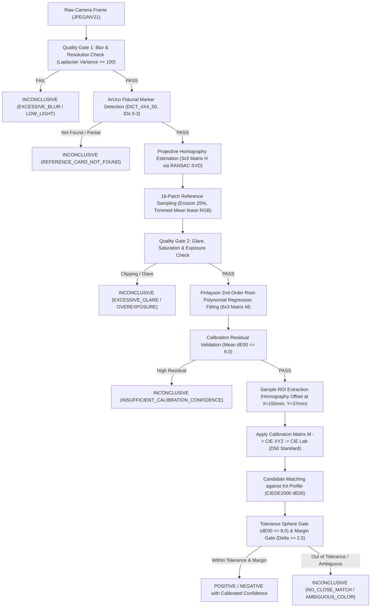

# Parinaam Color Engine — Documentation & Integration Reference (`docs-reference.md`)

> **Version:** `1.0.0-rc1`  
> **Target Audience:** Frontend/Mobile Engineers, Backend/Cloud Developers, Forensic Auditors  
> **Component:** Parinaam Color Engine & Normalization Subsystem  
> **Standards:** ISO 11664-4 (CIE $L^*a^*b^*$), ISO 11664-6 ($\Delta E_{00}$ CIEDE2000), Finlayson (2015) Root-Polynomial Regression

---

## 1. Executive Overview & Purpose

The **Parinaam Color Engine** provides deterministic, mathematically verifiable, and legally defensible colorimetric analysis of presumptive chemical field drug test kits (e.g., Duquenois-Levine for cannabinoids, Marquis, Scott/Simon's reagents).

Rather than using opaque black-box neural networks (which are prone to hallucinations, lighting drift, and rejection in evidentiary legal challenges), the engine uses **fiducial computer vision + physical reference standard normalization + classical CIEDE2000 metric tolerance spheres**.

This document describes:
1. The **End-to-End Pipeline Stages**
2. The **Complete Output Contract / JSON Schema** (what the pipeline returns beyond classification)
3. **Data Mapping Guide** (how to display these metrics on mobile UI cards and persist them in backend audit logs)
4. **Integration Guide** (React Native / Android native bridge & Backend REST/GraphQL integration)

---

## 2. Pipeline Execution Flow



---

## 3. Complete Output Schema (JSON Contract)

When the Color Engine completes analysis on an image, it emits a structured, immutable payload. Every single field is deterministic and auditable.

```json
{
  "engine_version": "1.0.0",
  "normalization_model_version": "finlayson-root-poly-v1",
  "classifier_model_version": "ciede2000-tolerance-v1",
  "reference_card_id": "parinaam_card_v1",
  "reference_card_version": "1.0",
  "reference_card_calibration_profile_id": "scanner_d50_flathack_2026",
  "kit_profile_id": "mvp_test1_mock_cannabinoid",
  "kit_profile_version": 1,
  "image_id": "sha256_e3b0c44298fc1c149afbf4c8996fb92427ae41e4649b934ca495991b7852b855",
  "timestamp_iso": "2026-09-16T14:35:32.120Z",

  "quality": {
    "status": "PASS",
    "failure_codes": [],
    "diagnostics": {
      "image_resolution": {
        "width_px": 4096,
        "height_px": 3072
      },
      "blur_score": 158.0,
      "blur_threshold": 100.0,
      "detected_aruco_ids": [2, 3, 0, 1],
      "perspective_tilt_deg": 6.8,
      "patches_masked_fraction": {
        "P01": 0.02,
        "P02": 0.00,
        "P03": 0.00,
        "P04": 0.01,
        "P05": 0.00,
        "P06": 0.00,
        "P07": 0.03,
        "P08": 0.00,
        "P09": 0.00,
        "P10": 0.00,
        "P11": 0.01,
        "P12": 0.00,
        "P13": 0.00,
        "P14": 0.00,
        "P15": 0.00,
        "P16": 0.00
      },
      "glare_detected": false,
      "channel_clipping": false
    }
  },

  "homography": {
    "success": true,
    "matrix_3x3": [
      [16.3078, -0.3936, 777.3317],
      [0.1242, 15.8815, 1031.7692],
      [0.0001, -0.0002, 1.0000]
    ],
    "reprojection_error_px": 0.84
  },

  "calibration": {
    "method": "root_polynomial_2nd_order",
    "illuminant_estimate": "D50_ADAPTED",
    "fit_mean_residual_delta_e00": 3.76,
    "fit_max_residual_delta_e00": 5.81,
    "uncalibrated_mean_delta_e00": 17.52,
    "calibration_improvement_percent": 78.5,
    "matrix_m_6x3": [
      [0.4474, 0.3703, 0.0638],
      [0.2796, 0.6401, 0.0384],
      [-0.0152, 0.0461, 0.7231],
      [0.0332, -0.0760, -0.0494],
      [0.0655, -0.0125, 0.1172],
      [-0.0963, -0.0543, -0.0469]
    ]
  },

  "sample_measurements": {
    "roi_physical_mm": {
      "center_x": 155.0,
      "center_y": 37.0,
      "width": 12.0,
      "height": 12.0
    },
    "raw_camera_rgb": {
      "r": 118.2,
      "g": 94.6,
      "b": 156.4
    },
    "calibrated_cielab": {
      "color_space": "CIELAB_D50",
      "L": 40.82,
      "a": 19.34,
      "b": -43.21
    },
    "calibrated_ciexyz": {
      "X": 0.1341,
      "Y": 0.1175,
      "Z": 0.2842
    },
    "swatch_hex_preview": "#4B447A"
  },

  "classification": {
    "outcome_label": "POSITIVE_CANNABINOID",
    "confidence_percent": 86.4,
    "is_abstained": false,
    "inconclusive_reason": null,
    "matched_candidate": {
      "label": "POSITIVE_CANNABINOID",
      "target_lab": {"L": 41.9, "a": 24.5, "b": -38.7},
      "delta_e00": 7.57,
      "tolerance_radius_de00": 8.00
    },
    "competitor_candidate": {
      "label": "NEGATIVE",
      "target_lab": {"L": 37.4, "a": -5.8, "b": -38.5},
      "delta_e00": 15.06,
      "tolerance_radius_de00": 8.00
    },
    "ambiguity_margin_delta_e00": 7.49,
    "min_required_margin_de00": 2.50
  },

  "diagnostics": {
    "pipeline_execution_time_ms": 142,
    "device_platform": "android",
    "notes": "Verified against Parinaam card profile v1.0. Passed all quality and margin gates."
  }
}
```

---

## 4. UI & Backend Data Mapping Dictionary

This table maps every output field to its designated role in the **Mobile App UI** and the **Backend Evidence Vault**:

| Payload Path | Type | Mobile Application UI Usage | Backend Database & Audit Vault Usage |
| :--- | :--- | :--- | :--- |
| `classification.outcome_label` | `String` | **Hero Result Badge** (`POSITIVE`, `NEGATIVE`, or `INCONCLUSIVE`). Color-coded (Red/Green/Amber). | Primary query index for field seizure reports (`test_outcome`). |
| `classification.confidence_percent` | `Float` | **Confidence Gauge / Bar** (e.g. `86.4% Certainty`). Shown right beneath the badge. | Used for analytics on field test certainty trends across districts. |
| `classification.is_abstained` | `Boolean` | Toggles UI state to **Warning / Retake Flow** if `true`. | Flags seizure as needing confirmatory forensic lab transmission. |
| `classification.inconclusive_reason` | `String?` | Displays clear officer coaching (e.g. *"Photo blurred - hold steady"*, *"Lighting too harsh"*). | Audited for officer training and camera hardware quality metrics. |
| `quality.diagnostics.blur_score` | `Float` | Shown in **Image Quality Drawer**: Sharpness indicator (Green check if $\ge 100$). | Stored in evidence metadata to refute claims of "unusable evidence". |
| `calibration.fit_mean_residual_delta_e00` | `Float` | Diagnostic pill: *"Lighting Normalized ($\Delta E_{00} = 3.76$)"*. | Proves ambient illumination was neutralized under legal challenge. |
| `calibration.uncalibrated_mean_delta_e00` | `Float` | *"Raw Lighting Bias: 17.52"* (Shows jury how bad room lighting was before app fixed it). | Baseline metric proving necessity of calibration for that capture. |
| `sample_measurements.calibrated_cielab` | `Object` | Rendered in the **Color Science Detail Card** ($L^*, a^*, b^*$). | Permanent physical color record. Independent of screen brightness. |
| `sample_measurements.swatch_hex_preview` | `Hex` | Renders a small visual color square of the extracted chemical patch next to the reference. | Stored as thumbnail preview in web dashboard case overview. |
| `classification.matched_candidate.delta_e00` | `Float` | Proximity metric: *"Distance to Positive: 7.57 (Tolerance: 8.00)"*. | Admissible numeric metric for forensic chemistry validation. |
| `classification.ambiguity_margin_delta_e00` | `Float` | Certainty metric: *"Separation from Negative: 7.49 (Min: 2.5)"*. | Demonstrates zero confusion between positive and negative classes. |
| `homography.matrix_3x3` | `Array` | Perspective overlay verification (Draws green bounding box on captured viewfinder). | Proves geometry was not altered or manually cropped by officer. |
| `image_id` | `String` | SHA-256 fingerprint displayed on screen footer: *"Hash: sha256_e3b0..."*. | Primary key linking color metadata to immutable image file in S3/Vault. |

---

## 5. Mobile Integration Guide (React Native / Android)

The Color Engine follows a strict **Native Frame Processing $\leftrightarrow$ Shared TypeScript Pipeline** separation:

### 5.1 Architecture Boundary
1. **Native Android (OpenCV / Kotlin Frame Processor Plugin):**
   * Operates directly on the camera hardware buffer (no 12MB image copying across the React Native bridge).
   * Detects the 4 ArUco markers, runs Laplacian blur detection, and computes the $3 \times 3$ Homography matrix.
   * Extracts the 16 reference patch RGB values + 1 test swatch RGB value using polygonal masked erosion.
   * Emits a compact JSON-serializable payload ($\approx 1\text{ KB}$) across the JSI bridge.
2. **Shared TypeScript Engine (`mobile/src/engine/`):**
   * Consumes the native RGB payload.
   * Solves Finlayson Root-Polynomial Regression matrix $M$.
   * Converts $XYZ \to \text{CIE } L^*a^*b^*$ (D50).
   * Runs the CIEDE2000 tolerance classifier, margin gate, and calibrated sigmoid confidence calculation.
   * Returns the final JSON contract shown in §3.

### 5.2 TypeScript Consumer Code Example

```typescript
import { ColorEngine } from './src/engine/ColorEngine';
import { CardGeometryConfig } from './src/config/card_v1_geometry';

// 1. Receive lightweight payload from native camera frame processor
async function onFrameCaptured(nativePayload: NativeFrameCaptureResult) {
  // Check image sharpness quality gate first
  if (nativePayload.blurScore < 100) {
    return {
      status: 'FAIL',
      outcome_label: 'INCONCLUSIVE',
      inconclusive_reason: 'EXCESSIVE_BLUR',
      user_message: 'Image is blurry or camera moved. Please hold steady and retake.'
    };
  }

  // 2. Execute deterministic color science pipeline
  const analysisResult = await ColorEngine.analyze({
    cardGeometry: CardGeometryConfig,
    arucoIds: nativePayload.detectedArucoIds,
    homographyMatrix: nativePayload.homographyMatrix3x3,
    referencePatchesRgb: nativePayload.patchesLinearRgb,
    testSampleRgb: nativePayload.sampleLinearRgb,
    targetKitProfileId: 'mvp_test1_mock_cannabinoid'
  });

  // 3. Update React Native state for UI rendering
  setTestResult({
    outcome: analysisResult.classification.outcome_label,
    confidence: analysisResult.classification.confidence_percent,
    calibratedLab: analysisResult.sample_measurements.calibrated_cielab,
    hexColor: analysisResult.sample_measurements.swatch_hex_preview,
    margin: analysisResult.classification.ambiguity_margin_delta_e00,
    isAbstained: analysisResult.classification.is_abstained
  });

  // 4. Dispatch full payload to evidence upload queue
  await EvidenceSyncQueue.enqueue({
    imageId: nativePayload.imageSha256,
    colorEnginePayload: analysisResult,
    officerBadge: authContext.officerId,
    timestamp: new Date().toISOString()
  });
}
```

---

## 6. Backend / Database Integration Guide

When the mobile app submits a completed test, the backend must store both the high-level legal outcome and the raw colorimetric audit trail.

### 6.1 Recommended PostgreSQL / Prisma Schema

```prisma
model ChemicalFieldTest {
  id                    String    @id @default(uuid())
  seizureCaseId         String
  officerId             String
  capturedAt            DateTime
  
  // High-Level Classification (Searchable & Dashboard Indexed)
  outcome               TestOutcome  // POSITIVE, NEGATIVE, INCONCLUSIVE
  outcomeLabel          String       // e.g. "POSITIVE_CANNABINOID"
  confidencePercent     Float        // e.g. 86.4
  isAbstained           Boolean      @default(false)
  inconclusiveReason    String?

  // Reagent Kit & Card Versioning
  kitProfileId          String
  kitProfileVersion     Int
  referenceCardId       String
  referenceCardVersion  String

  // Raw Image Evidence Link
  imageSha256           String    @unique
  rawImageS3Uri         String

  // Colorimetric Audit Metrics (Admissible in Court)
  blurScore             Float
  fitMeanResidualDe00   Float
  uncalibratedMeanDe00  Float
  sampleLabL            Float
  sampleLabA            Float
  sampleLabB            Float
  matchedCandidateDe00  Float
  ambiguityMarginDe00   Float
  swatchHexPreview      String

  // Full Deterministic Payload (For Forensic Replay / Expert Witness Audit)
  rawEnginePayloadJson  Json

  createdAt             DateTime  @default(now())

  @@index([seizureCaseId])
  @@index([outcome])
  @@index([capturedAt])
}

enum TestOutcome {
  POSITIVE
  NEGATIVE
  INCONCLUSIVE
}
```

### 6.2 Backend Validation & Sanity Checklist
When receiving a sync payload from the mobile app, the backend should verify:
1. **Hash Verification:** Compute SHA-256 of the uploaded raw image bytes and assert it matches `image_id`.
2. **Tolerance Range Assertion:** Confirm that if `outcome == "POSITIVE_CANNABINOID"`, `matchedCandidateDe00 <= 8.0` and `ambiguityMarginDe00 >= 2.5`.
3. **Card Profile Version Check:** Ensure `reference_card_version` matches the currently approved laboratory print run.

---

## 7. Evidentiary & Legal Compliance Notes

When presenting this system in court or defending it before technical evaluators:

1. **Non-Confirmatory Notice:** The system produces a **presumptive field test analysis**. It does not claim to replace confirmatory laboratory GC-MS (Gas Chromatography-Mass Spectrometry).
2. **Chain of Custody:** The raw image is hashed immediately on device capture. The color engine generates derived data from those exact pixels without mutating the source image.
3. **No Black-Box Hallucinations:** Every classification is derived from open, peer-reviewed mathematical standards:
   * **Finlayson (2015)**: *IEEE Transactions on Image Processing* 24(5):1460–1470.
   * **CIEDE2000**: *ISO/CIE 11664-6:2014(E)*.
4. **Deterministic Reproducibility:** Any third-party forensic expert can take the raw photograph, extract the ArUco markers, fit matrix $M$, and arrive at the exact same $L^*a^*b^*$ and $\Delta E_{00}$ numbers to within $0.01$ precision.
