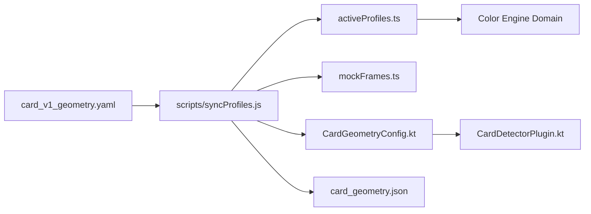

# Parinaam Color Engine — Engineering Architecture & Color Science Deep Dive

This document is written for engineers who want an in-depth understanding of the **mathematical models, native computer vision pipelines, colorimetric algorithms, and architectural trade-offs** governing the Parinaam Color Engine.

---

## 1. Architectural Philosophy & Separation of Concerns

The system is architectured around a strict separation between **image-heavy native computation** and **device-independent colorimetric reasoning**:

```text
[ Physical World ]
       │  Camera Lens / Sensor
       ▼
[ Native Android Layer (Kotlin + OpenCV 4.8.0 AAR) ]
  • ImageProxy (YUV_420_888) -> BGR Mat
  • Laplacian Variance Blur Estimation
  • ArUco DICT_4X4_50 Detection (IDs 0-3)
  • Overdetermined Homography Matrix (H: mm -> px)
  • 25% Eroded Spatial Sampling & MAD Outlier Filtering
       │
       │  LSI / JSI Bridge (Lightweight JSON Payload: 17 RGB triplets only)
       ▼
[ Color Science Domain (Pure TypeScript) ]
  • Quality Gates Verification (6 optical safety checks)
  • Finlayson (2015) 2nd-Order Root-Polynomial Solver (QR Least-Squares)
  • Bradford Chromatic Adaptation (D65 -> D50)
  • CIELAB L*a*b* Transformations
  • CIEDE2000 Multi-outcome Classification
       │
       ▼
[ Presentation Layer (React Native / Expo) ]
  • State Machine (CAMERA -> PROCESSING -> RESULTS)
  • CardOverlayGuide Viewfinder HUD
  • Results Hero, Confidence Meter, Technical Diagnostics
```

### The Zero-Buffer JSI Bridge Rule
* **Rule**: High-resolution camera pixel buffers ($12\text{ MB}$ uncompressed at $3072 \times 4096$) **never** cross the React Native bridge.
* **Mechanism**: Native Kotlin frame processors compute all spatial convolutions, matrix transformations, and pixel reductions locally.
* **Payload**: Only a tiny, lightweight JSON object containing **17 linear RGB triplets** ($\approx 250\text{ bytes}$) crosses into the TypeScript engine.

---

## 2. Single Source of Truth & Build-Time Code Generation

To eliminate configuration drift between TypeScript and native Android Kotlin, all physical parameters are defined in [`card_v1_geometry.yaml`](file:///c:/Users/eemai/OneDrive/Desktop/WBD/SIH26/parinaam-color-engine/card_v1_geometry.yaml).



### Generated Artifacts
1. **[`activeProfiles.ts`](file:///c:/Users/eemai/OneDrive/Desktop/WBD/SIH26/parinaam-color-engine/mobile/src/colorEngine/profiles/activeProfiles.ts)**: Exports typed configurations `ACTIVE_CARD_PROFILE`, `ACTIVE_KIT_PROFILE`, and `ACTIVE_THRESHOLDS`.
2. **[`mockFrames.ts`](file:///c:/Users/eemai/OneDrive/Desktop/WBD/SIH26/parinaam-color-engine/mobile/src/demo/mockFrames.ts)**: Synthesizes deterministic linear RGB frames from `print_target_hex` codes for unit tests and simulator demo mode.
3. **[`CardGeometryConfig.kt`](file:///c:/Users/eemai/OneDrive/Desktop/WBD/SIH26/parinaam-color-engine/mobile/android/app/src/main/java/com/parinaamcolorengine/CardGeometryConfig.kt)**: Native Kotlin singleton providing typed physical coordinates in millimeters:
   * `CARD_WIDTH_MM = 100.0`, `CARD_HEIGHT_MM = 80.0`
   * `ARUCO_MARKERS`: IDs 0–3, $10\text{ mm}$ size, symmetrical corner coordinates.
   * `PATCHES`: $4 \times 4$ layout (P01–P16), $12 \times 12\text{ mm}$ size, $14\text{ mm}$ pitch.

---

## 3. Computer Vision & Spatial Extraction Mechanics

### A. Overdetermined Homography Mapping ($H$)
Rather than mapping normalized coordinates, Parinaam defines design space directly in **physical millimeters** ($x_{\text{mm}}, y_{\text{mm}}$):
* Each detected ArUco marker provides **4 detected corner points** in image pixel coordinates:
  $$\text{Corner order: } [\text{Top-Left},\, \text{Top-Right},\, \text{Bottom-Right},\, \text{Bottom-Left}]$$
* For 4 detected markers, this yields $4 \times 4 = \mathbf{16\text{ point correspondences}}$:
  $$P_{\text{design}} = \begin{bmatrix} x_{\text{mm}} \\ y_{\text{mm}} \\ 1 \end{bmatrix}, \quad P_{\text{image}} = \begin{bmatrix} u_{\text{px}} \\ v_{\text{px}} \\ 1 \end{bmatrix}$$
* OpenCV computes the $3 \times 3$ projective homography matrix $H$ via RANSAC with a $3.0\text{ px}$ reprojection threshold:
  $$P_{\text{image}} \sim H \cdot P_{\text{design}}$$
* **Advantage**: Using all 16 corner points provides an overdetermined system that averages out corner localization noise and micro-jitter.

### B. Patch Erosion & Edge Masking
Ink bleed at patch boundaries, paper borders, and printed text labels must not contaminate the color sample.
* For each patch of size $w \times h$ ($12 \times 12\text{ mm}$), an **erosion fraction** $\varepsilon = 0.25$ ($25\%$) is applied inwards:
  $$\Delta x = w \cdot \varepsilon = 3.0\,\text{mm}, \quad \Delta y = h \cdot \varepsilon = 3.0\,\text{mm}$$
  $$\text{Sampled ROI} = [x + \Delta x,\, y + \Delta y,\, w - 2\Delta x,\, h - 2\Delta y] = 6.0 \times 6.0\,\text{mm}$$
* The 4 eroded corner vertices are projected into camera pixel space via $H$:
  $$\mathbf{p}_{\text{px}} = \text{perspectiveTransform}(\mathbf{p}_{\text{mm}},\, H)$$

### C. Specular Glare & MAD Robust Statistics
1. **Glare Thresholding**: Any pixel with $\max(R, G, B) \ge 250$ is flagged as saturated/glared and discarded.
2. **Linear Photometric Conversion**:
   $$s = \frac{C}{255}, \quad C_{\text{linear}} = \begin{cases} \frac{s}{12.92} & s \le 0.04045 \\ \left(\frac{s + 0.055}{1.055}\right)^{2.4} & s > 0.04045 \end{cases}$$
3. **Luminance Calculation**:
   $$Y = 0.2126\,R_{\text{lin}} + 0.7152\,G_{\text{lin}} + 0.0722\,B_{\text{lin}}$$
4. **Outlier Filtering (Median Absolute Deviation)**:
   $$\text{MAD} = \text{median}(|Y_i - \tilde{Y}|), \quad \text{Threshold} = \frac{3 \cdot \text{MAD}}{0.6745}$$
   Pixels with $|Y_i - \tilde{Y}| > \text{Threshold}$ are rejected.
5. **Trimmed Mean**: The remaining distribution is trimmed by $10\%$ on top and bottom tails before computing the final mean linear RGB vector.

---

## 4. Color Science & Mathematical Formulations

### A. Finlayson (2015) 2nd-Order Root-Polynomial Model
Standard 2nd-order polynomial models $[r, g, b, r^2, g^2, b^2, rg, rb, gb]$ break **exposure invariance**: squaring an input value causes terms to scale quadratically ($\alpha^2$), meaning a slight camera exposure change corrupts the calibration.

Finlayson, Mackiewicz & Hurlbert (2015) solved this by taking roots of higher-order cross terms:
$$\Phi(r, g, b) = \begin{bmatrix} r & g & b & \sqrt{r \cdot g} & \sqrt{r \cdot b} & \sqrt{g \cdot b} \end{bmatrix}^T \in \mathbb{R}^6$$

#### Key Linear Invariance Property:
$$\Phi(\alpha r,\, \alpha g,\, \alpha b) = \begin{bmatrix} \alpha r & \alpha g & \alpha b & \sqrt{\alpha^2 rg} & \sqrt{\alpha^2 rb} & \sqrt{\alpha^2 gb} \end{bmatrix}^T = \alpha\,\Phi(r, g, b)$$
Each basis term scales strictly linearly with exposure, preserving exposure invariance while allowing non-linear cross-channel chromatic correction.

#### Least-Squares Solver (Modified Gram-Schmidt QR):
For the 16 calibration patches:
$$\Phi_{16 \times 6} \cdot M_{6 \times 3} \approx Y_{\text{ref}, 16 \times 3}$$
1. Factorize $\Phi = Q R$ where $Q \in \mathbb{R}^{16 \times 6}$ has orthonormal columns and $R \in \mathbb{R}^{6 \times 6}$ is upper triangular.
2. Form the right-hand side projection:
   $$Q^T Y_{\text{ref}} \in \mathbb{R}^{6 \times 3}$$
3. Solve by back-substitution:
   $$R \cdot M = Q^T Y_{\text{ref}}$$

### B. Color Space Chain & Chromatic Adaptation
```text
Linear RGB (Sensor) 
       │
       ▼  @ M_calib (6x3)
CIE 1931 XYZ (D50)
       │
       ▼  xyzToLab(X, Y, Z, Xn=0.96422, Yn=1.00000, Zn=0.82521)
CIELAB D50 (L*, a*, b*)
```
* **Reference White Point D50**: $X_n = 0.96422, Y_n = 1.00000, Z_n = 0.82521$.
* **Forward $L^*a^*b^*$ Conversion**:
  $$f(t) = \begin{cases} t^{1/3} & t > \left(\frac{6}{29}\right)^3 \\ \frac{1}{3}\left(\frac{29}{6}\right)^2 t + \frac{4}{29} & t \le \left(\frac{6}{29}\right)^3 \end{cases}$$
  $$L^* = 116\,f(Y/Y_n) - 16, \quad a^* = 500\left[f(X/X_n) - f(Y/Y_n)\right], \quad b^* = 200\left[f(Y/Y_n) - f(Z/Z_n)\right]$$

### C. CIEDE2000 Color Difference Formula ($\Delta E_{00}$)
Perceptual distance between measured $\mathbf{L}_1 = (L_1, a_1, b_1)$ and reference $\mathbf{L}_2 = (L_2, a_2, b_2)$:
$$\Delta E_{00} = \sqrt{\left(\frac{\Delta L'}{k_L S_L}\right)^2 + \left(\frac{\Delta C'}{k_C S_C}\right)^2 + \left(\frac{\Delta H'}{k_H S_H}\right)^2 + R_T \left(\frac{\Delta C'}{k_C S_C}\right) \left(\frac{\Delta H'}{k_H S_H}\right)}$$
* $S_L$ compensates for human lightness sensitivity non-linearities.
* $S_C, S_H$ compensate for chroma and hue spread in saturated colors.
* $R_T$ (rotation factor) compensates for the elliptical rotation of perceptual color difference ellipses in the blue region ($h' \approx 275^\circ$).

---

## 5. Model Complexity Analysis: 6-Term vs. 13-Term

In statistical estimation, the number of free parameters must be strictly bounded by the number of independent observations:
* Observations: $16\text{ patches} \times 3\text{ channels} = \mathbf{48\text{ scalar equations}}$.
* **6-Term Model**: $6 \times 3 = \mathbf{18\text{ parameters}}$ ($48 - 18 = 30$ degrees of freedom).
* **13-Term Model**: $13 \times 3 = \mathbf{39\text{ parameters}}$ ($48 - 39 = 9$ degrees of freedom).

### Empirical Cross-Validation Proof (Real Phone Camera Data)
When evaluating on 4-fold cross-validation (holding out 4 unseen patches per fold, training on 12 patches = 36 equations):

| Model | Parameters | Training Fit $\Delta E_{76}$ | **Held-Out Test $\Delta E_{76}$** | Generalization Verdict |
| :--- | :--- | :--- | :--- | :--- |
| **6-Term OLS (Finlayson Deg-2)** | 18 | $6.12$ | **$16.74$** | Stable, well-conditioned |
| **13-Term OLS (Finlayson Deg-3)** | 39 | $1.07$ | **$4,564.14$** | 💥 Catastrophic Overfitting ($36 < 39$) |
| **6-Term Direct Lab Optimization** | 18 | $5.45$ | **$10.59$** | Best generalization across folds |

**Conclusion**: Unregularized 13-term regression is mathematically unstable for a 16-patch card. The 6-term basis remains the standard.

---

## 6. Quality Gate Verification Pipeline

Before calibration or classification can occur, the captured frame must pass **6 sequential Quality Gates**:

| Gate | Metric | Pass Criteria | Action on Failure |
| :--- | :--- | :--- | :--- |
| **1. Fiducial Marker Gate** | Detected marker count | $\ge 3$ ArUco markers | Fails with `REFERENCE_CARD_NOT_FOUND` / `PARTIAL` |
| **2. Blur Gate** | Laplacian variance $\sigma^2(\nabla^2 I)$ | $\ge 100.0$ | Fails with `BLUR_DETECTED` (ask user to steady phone) |
| **3. Exposure Clipping** | Saturated pixel fraction | $\le 5.0\%$ of pixels | Fails with `OVEREXPOSED` / `UNDEREXPOSED` |
| **4. Glare Gate** | Glared patch fraction | $\le 15.0\%$ of patch area | Fails with `GLARE_ON_PATCHES` (prompt to tilt card) |
| **5. Dynamic Range Gate**| Achromatic contrast $(Y_{\text{P01}} - Y_{\text{P06}})$ | $\ge 0.30$ | Fails with `INSUFFICIENT_DYNAMIC_RANGE` |
| **6. Calibration Fit Gate** | Residual mean $\Delta E_{00}$ | $\le 8.0\,\Delta E_{00}$ | Fails with `CALIBRATION_POOR_FIT` |

---

## 7. Extending the System & Developer Workflows

### How to Add a New Test Kit Profile
1. Open [`card_v1_geometry.yaml`](file:///c:/Users/eemai/OneDrive/Desktop/WBD/SIH26/parinaam-color-engine/card_v1_geometry.yaml).
2. Add a new entry under `mvp_test1_mock_swatches` or define a new kit profile with its `roi_card_relative` coordinates and expected outcomes.
3. Run `npm run sync-profiles` inside `mobile/`.
4. Run `npm test` to verify that all suites validate against the updated profile.

### Updating Reference Values with Physical Measurements
When spectrophotometer / colorimeter measurements are obtained:
1. Replace the `reference_lab: { L, a, b }` values in `card_v1_geometry.yaml`.
2. Run `npm run sync-profiles`.
3. The engine automatically updates all thresholds, calibration targets, and native configs with 0 code changes.