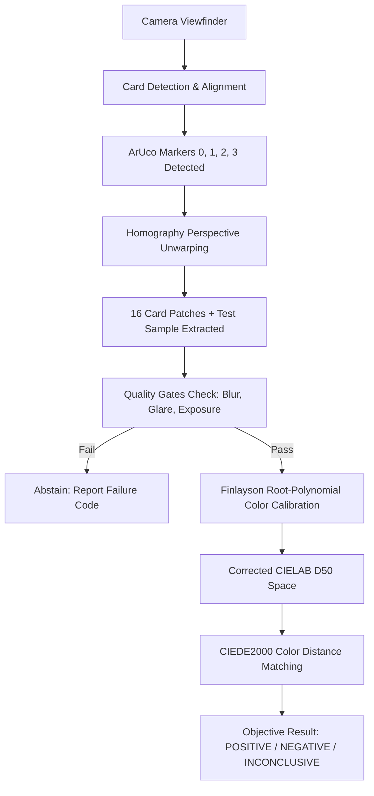

# Parinaam Color Engine — New Developer Onboarding Guide

Welcome to the **Parinaam Color Engine** project! This document is designed to give you a complete, intuitive, and comprehensive understanding of the entire codebase, what it does, why it exists, how every file connects, and how you can run and contribute to it from day one.

---

## 1. What is Parinaam Color Engine? (The Big Picture)

### The Real-World Problem
When field officers or healthcare workers use chemical presumptive test kits (such as drug testing or diagnostic test strips), they rely on **color changes** (e.g., a test spot turning purple for a positive reaction, or tan/clear for a negative reaction).
However, **human eyes and smartphone cameras are notoriously unreliable under real-world lighting**:
* Taking a photo under warm indoor lighting makes everything look yellow.
* Taking a photo under fluorescent tube lights makes everything look green.
* Cheap smartphone sensors automatically apply aggressive saturation and auto-white-balance filters, distorting colors unpredictably.
* An optical illusion or subjective human bias can lead to false positives or false negatives.

### The Parinaam Solution
Parinaam turns a standard smartphone camera into an **objective, laboratory-grade spectrophotometer**:
1. A small physical printed reference card ($100 \times 80$ mm) with **4 ArUco fiducial markers** and **16 curated color patches** is placed next to the test sample.
2. The phone camera captures both the card and the test sample in a single frame.
3. The native computer vision pipeline unwarps the perspective angle, extracts the 16 reference patches, and measures how ambient room lighting has distorted them.
4. An advanced mathematical regression model (**Finlayson 2015 Root-Polynomial Calibration**) mathematically cancels out the ambient lighting shift.
5. The test swatch color is corrected into absolute, device-independent color space (**CIELAB D50**) and objectively classified using **CIEDE2000** color distance with mathematical confidence scores.



---

## 2. Core Terminology & Glossary

| Term | Simple Explanation | Where It Lives in Code |
| :--- | :--- | :--- |
| **Single Source of Truth** | A single YAML configuration file where all physical dimensions, coordinates, and targets are defined so numbers are never duplicated. | [`card_v1_geometry.yaml`](file:///c:/Users/eemai/OneDrive/Desktop/WBD/SIH26/parinaam-color-engine/card_v1_geometry.yaml) |
| **ArUco Marker** | A 2D high-contrast black-and-white square barcode designed for fast, robust computer vision corner detection. We use dictionary `DICT_4X4_50` with marker IDs `0, 1, 2, 3`. | `mobile/android/app/.../CardDetectorPlugin.kt` |
| **Homography ($H$)** | A $3 \times 3$ transformation matrix that maps coordinates from a tilted 2D surface (the card viewed at an angle) into flat pixel space or a rectified top-down view. | `CardDetectorPlugin.kt` / `verify_card_photo.py` |
| **Patch Erosion** | Shrinking the sampling box inwards by 25% from each edge so the algorithm only samples pure patch ink, avoiding borders, shadows, or text. | `EROSION_FRACTION = 0.25` in `CardDetectorPlugin.kt` |
| **Trimmed Mean (MAD)** | A robust statistical method that drops extreme outlier pixels (e.g. dust, paper texture, tiny specular glares) using Median Absolute Deviation. | `samplePatch()` in `CardDetectorPlugin.kt` |
| **Linear RGB** | RGB pixel values with camera gamma ($s \approx 2.4$) removed. Optical light physically combines linearly, so all color calibration **must** be done in linear RGB. | `srgbToLinear()` in `xyzLab.ts` and `CardDetectorPlugin.kt` |
| **CIELAB ($L^*a^*b^*$)** | A standard international color space modeled after human visual perception: $L^*$ is Lightness ($0..100$), $a^*$ is Green-to-Red ($-128..+127$), and $b^*$ is Blue-to-Yellow ($-128..+127$). | `mobile/src/colorEngine/colorSpace/xyzLab.ts` |
| **CIEDE2000 ($\Delta E_{00}$)** | The state-of-the-art color difference formula that measures the perceptual distance between two colors. $\Delta E_{00} < 1.0$ is virtually imperceptible to human eyes; $\Delta E_{00} > 10.0$ is a completely different color. | `mobile/src/colorEngine/colorSpace/deltaE.ts` |
| **Quality Gates** | Automated optical safety checks (blur, glare, exposure clipping, dynamic range, perspective angle) that prevent the app from giving a wrong answer if image quality is inadequate. | `mobile/src/colorEngine/qualityGates/` |
| **Abstention** | The deliberate decision by the engine to output `INCONCLUSIVE` rather than guessing when quality checks fail or colors are ambiguous. | `mobile/src/colorEngine/classifier/` |

---

## 3. Technology Stack

### Mobile Frontend
* **React Native / Expo (SDK 52)**: Cross-platform application runtime.
* **TypeScript**: Strict type-safety across the entire color engine, quality gates, and classification rules.
* **React Hooks & Custom State Machine**: Deterministic screen routing (`CAMERA` $\to$ `PROCESSING` $\to$ `RESULTS`).
* **`expo-camera` (`CameraView`)**: Camera stream integration for rapid local device testing in Expo Go.

### Native Android & Computer Vision
* **Kotlin**: Android native layer for high-throughput frame processing.
* **OpenCV Android SDK 4.8.0**: High-performance computer vision library (AAR).
* **OpenCV ArUco Module (`objdetect`)**: Hardware-accelerated fiducial marker identification.
* **React Native VisionCamera v4**: Frame processor architecture providing a direct JSI (JavaScript Interface) bridge between camera frames and TypeScript without crossing the bridge with heavy pixel buffers.
* **Android Camera2 API (`ExposureLockModule.kt`)**: Native module to lock auto-exposure and white balance during multi-frame acquisition.

### Build & Automation Tools
* **Node.js**: Profile synchronization and build scripts.
* **Python 3.12 (`opencv-python`, `numpy`, `scipy`)**: Diagnostic test runner and offline camera verification tools.
* **Jest**: Automated test runner (10 unit & flow test suites).

---

## 4. Complete Project Directory Structure

Here is the exact repository map and what each folder/file does:

```text
parinaam-color-engine/
│
├── card_v1_geometry.yaml          <-- ⭐️ SINGLE SOURCE OF TRUTH (Card & Mock Kit layout)
├── ARCHITECTURE.md                 <-- System architecture specification & design rationale
├── walkthrough.md                  <-- Progress log, verification data, and test results
│
├── photo-phone-camera/             <-- REAL PHYSICAL TEST DATA
│   ├── IMG_20260914_234901.jpg.jpeg <-- Actual camera capture of the printed physical card
│   ├── card_detection_annotated.png <-- Detected markers & perspective quad overlay
│   └── card_rectified_view.png      <-- Perfectly unwarped 1000x800 card visualization
│
├── docs/                           <-- DOCUMENTATION
│   ├── NEW_DEVELOPER_ONBOARDING_GUIDE.md  <-- This guide
│   └── ENGINEERING_ARCHITECTURE_DEEP_DIVE.md <-- In-depth engineering specification
│
└── mobile/                         <-- REACT NATIVE & ANDROID APPLICATION ROOT
    ├── app.json                    <-- Expo configuration (permissions, portrait locking, schemes)
    ├── package.json                <-- Dependencies, prestart/pretest lifecycle hooks
    ├── metro.config.js             <-- Metro bundler config & JS polyfill resolution
    │
    ├── scripts/                    <-- BUILD-TIME SYNC & PYTHON TOOLS
    │   ├── syncProfiles.js         <-- Translates card_v1_geometry.yaml into TS & Kotlin code
    │   ├── verify_card_photo.py    <-- Python offline verifier mirroring native Android plugin
    │   └── evaluate_calibration_models.py <-- Cross-validation script for testing models
    │
    ├── __tests__/                  <-- AUTOMATED TESTS (Jest)
    │   ├── smoke.test.ts           <-- Validates color science math (XYZ, Lab, deltaE)
    │   ├── demoFlow.test.ts        <-- Tests full pipeline flow against synthetic frames
    │   └── App.test.tsx            <-- Tests React Native UI rendering and navigation
    │
    ├── src/                        <-- CORE APPLICATION SOURCE CODE
    │   │
    │   ├── colorEngine/            <-- THE CORE MATHEMATICAL ENGINE
    │   │   ├── types.ts            <-- Core data models (DetectorPayload, Lab, QualityGates)
    │   │   ├── profiles/
    │   │   │   └── activeProfiles.ts <-- [AUTO-GENERATED] Ingests card and kit geometry
    │   │   ├── colorSpace/
    │   │   │   ├── xyzLab.ts       <-- sRGB <-> Linear <-> XYZ <-> CIELAB conversions
    │   │   │   └── deltaE.ts       <-- CIEDE2000 and CIEDE76 distance implementations
    │   │   ├── calibration/
    │   │   │   └── rootPolynomial.ts <-- Finlayson (2015) 2nd-order regression solver (QR)
    │   │   ├── qualityGates/
    │   │   │   └── index.ts        <-- 6 optical safety gate evaluations (Blur, Glare, etc.)
    │   │   └── classifier/
    │   │       └── index.ts        <-- Outcome matcher (POSITIVE / NEGATIVE / INCONCLUSIVE)
    │   │
    │   ├── demo/
    │   │   └── mockFrames.ts       <-- [AUTO-GENERATED] Synthetic test frames for demo mode
    │   │
    │   └── ui/                     <-- MOBILE USER INTERFACE
    │       ├── theme.ts            <-- Dark-mode visual tokens, colors, typography, spacing
    │       ├── components/
    │       │   └── CardOverlayGuide.tsx <-- Viewfinder reticle with 100x80mm aspect HUD
    │       └── screens/
    │           ├── CameraScreen.tsx  <-- Camera viewfinder, live guidance, Stage Demo injectors
    │           └── ResultsScreen.tsx <-- Result hero card, confidence meter, audit metrics
    │
    └── android/                    <-- NATIVE ANDROID DIRECTORY
        └── app/src/main/
            ├── AndroidManifest.xml <-- Permissions (Camera, hardware autofocus)
            ├── assets/
            │   └── card_geometry.json <-- [AUTO-GENERATED] Bundled Android JSON configuration
            └── java/com/parinaamcolorengine/
                ├── CardGeometryConfig.kt <-- [AUTO-GENERATED] Native Kotlin layout object
                ├── CardDetectorPlugin.kt <-- Native OpenCV ArUco detector & patch sampler
                ├── CardDetectorPluginPackage.kt <-- React Native package registration
                └── ExposureLockModule.kt <-- Camera2 auto-exposure lock module
```

---

## 5. The End-to-End Pipeline Step-by-Step

Here is how data flows from the physical world into the final user screen:

### Step 1: Definition in `card_v1_geometry.yaml`
Everything starts in `card_v1_geometry.yaml`.
* The card is $100 \times 80$ mm.
* The 4 ArUco markers are placed symmetrically at $(6, 7)$, $(84, 7)$, $(6, 63)$, and $(84, 63)$ mm.
* The 16 patches are laid out in a $4 \times 4$ grid ($12 \times 12$ mm each).
* The mock test swatch is located **5 mm to the right of the card, vertically centered** (`x: 105, y: 34, w: 12, h: 12` mm).

### Step 2: Build-Time Synchronization (`syncProfiles.js`)
When you run `npm start` or `npm test`, `mobile/scripts/syncProfiles.js` executes automatically.
It parses the YAML and generates:
1. `mobile/src/colorEngine/profiles/activeProfiles.ts` for TypeScript.
2. `mobile/src/demo/mockFrames.ts` for testing.
3. `mobile/android/app/.../CardGeometryConfig.kt` for native Kotlin.
4. `mobile/android/app/src/main/assets/card_geometry.json` for Android assets.
**No developer ever types numbers into code manually.**

### Step 3: Frame Processing (`CardDetectorPlugin.kt`)
On the phone, camera frames are captured at 30 fps:
1. Kotlin converts the camera frame buffer into an OpenCV grayscale image.
2. OpenCV scans for ArUco markers `0, 1, 2, 3`.
3. If at least 3 markers are found, it uses all 4 corners of each detected marker (up to 16 points) to calculate a homography matrix $H$ mapping card millimeter coordinates directly to camera pixels.
4. It calculates the exact pixel coordinates for all 16 patches and the test swatch.
5. It crops the regions, erodes the edges by 25%, removes specular glare (pixels $\ge 250$), and computes the trimmed-mean linear RGB values.
6. It sends a small JSON dictionary of 17 RGB triplets across the JSI bridge.

### Step 4: Quality Gates (`qualityGates/index.ts`)
TypeScript evaluates 6 gates:
* Was the image blurred? (Laplacian variance $< 100$)
* Was there direct camera flash/glare? (glared pixels $> 15\%$)
* Was the image over/underexposed? (clipping $> 5\%$)
* Was the card tilted at too steep an angle? (perspective $> 30^\circ$)
If any gate fails, the engine **immediately halts and reports the failure reason** to the user with actionable instructions (e.g. "Tilt card away from light to reduce glare").

### Step 5: Root-Polynomial Color Calibration (`rootPolynomial.ts`)
If gates pass, TypeScript fits the **Finlayson (2015) 2nd-Order Root-Polynomial Model**:
$$\Phi(r, g, b) = [r,\, g,\, b,\, \sqrt{rg},\, \sqrt{rb},\, \sqrt{gb}]$$
Using Modified Gram-Schmidt QR decomposition, it solves:
$$\Phi_{16 \times 6} \cdot M_{6 \times 3} \approx Y_{\text{ref}}$$
This matrix $M$ mathematically un-distorts the ambient room light.

### Step 6: Test Kit Classification (`classifier/index.ts`)
1. The test swatch's linear RGB is expanded through $\Phi$ and multiplied by $M$.
2. The resulting XYZ is converted to absolute **CIELAB D50** space ($L^*a^*b^*$).
3. The engine calculates the **CIEDE2000 distance ($\Delta E_{00}$)** against the expected kit outcomes:
   * Violet family ($L^* \approx 33.8, a^* \approx 45.0, b^* \approx -38.5$) $\to$ `POSITIVE_CANNABINOID`
   * Muted tan ($L^* \approx 75.1, a^* \approx 7.2, b^* \approx 42.2$) $\to$ `NEGATIVE`
4. If the closest match is within tolerance ($\Delta E_{00} \le 10.0$) and separated by an ambiguity margin ($\ge 2.5\,\Delta E_{00}$), it confirms the result! Otherwise, it outputs `INCONCLUSIVE`.

---

## 6. How to Run, Test, and Demo

### Running Automated Unit Tests
To verify all math, navigation, and logic across the pipeline:
```powershell
cd mobile
npm test
```
*(Runs 10/10 passing tests across 3 suites: `smoke.test.ts`, `demoFlow.test.ts`, `App.test.tsx`)*

### Starting the Mobile App Server
To launch the Expo development server:
```powershell
cd mobile
npm start
```
* **Expo Go on Phone**: Scan the QR code in your terminal with the Expo Go app.
* **Web Browser**: Run `npm run start:web` to open a preview in Google Chrome.

### Running Offline Verification on a Real Camera Photo
If you take a photo of the card with your smartphone, you can run the offline OpenCV verifier immediately:
```powershell
python mobile/scripts/verify_card_photo.py photo-phone-camera/IMG_20260914_234901.jpg.jpeg
```
This script will detect markers, unwarp the perspective, extract all 16 patches, fit the calibration matrix, and display pre- vs post-calibration $\Delta E_{00}$ accuracy!